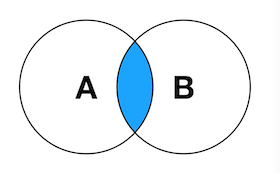
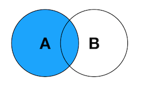
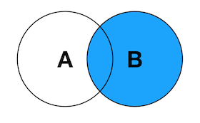
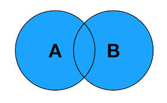
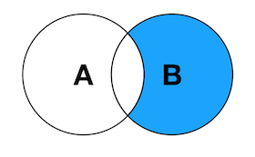

## join 的概念
join
INNER JOIN  内连接

内连接查询能将左表（表 A）和右表（表 B）中能关联起来的数据连接后返回。

LEFT JOIN
LEFT JOIN 一般被译作左连接，也写作 LEFT OUTER JOIN。左连接查询会返回左表（表 A）中所有记录，不管右表（表 B）中有没有关联的数据。在右表中找到的关联数据列也会被一起返回。

RIGHT JOIN

RIGHT JOIN 一般被译作右连接，也写作 RIGHT OUTER JOIN。右连接查询会返回右表（表 B）中所有记录，不管左表（表 A）中有没有关联的数据。在左表中找到的关联数据列也会被一起返回。

FULL OUTER JOIN
FULL OUTER JOIN 一般被译作外连接、全连接，实际查询语句中可以写作 FULL OUTER JOIN 或 FULL JOIN。外连接查询能返回左右表里的所有记录，其中左右表里能关联起来的记录被连接后返回。

LEFT JOIN EXCLUDING INNER JOIN
返回左表有但右表没有关联数据的记录集。

RIGHT JOIN EXCLUDING INNER JOIN
返回右表有但左表没有关联数据的记录集。

FULL OUTER JOIN EXCLUDING INNER JOIN
返回左表和右表里没有相互关联的记录集。

CROSS JOIN
返回左表与右表之间符合条件的记录的迪卡尔集。

>查考
1. https://zhuanlan.zhihu.com/p/29234064

